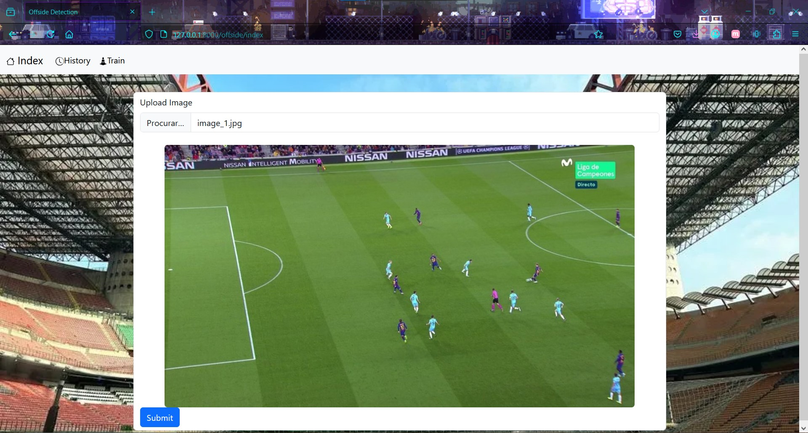
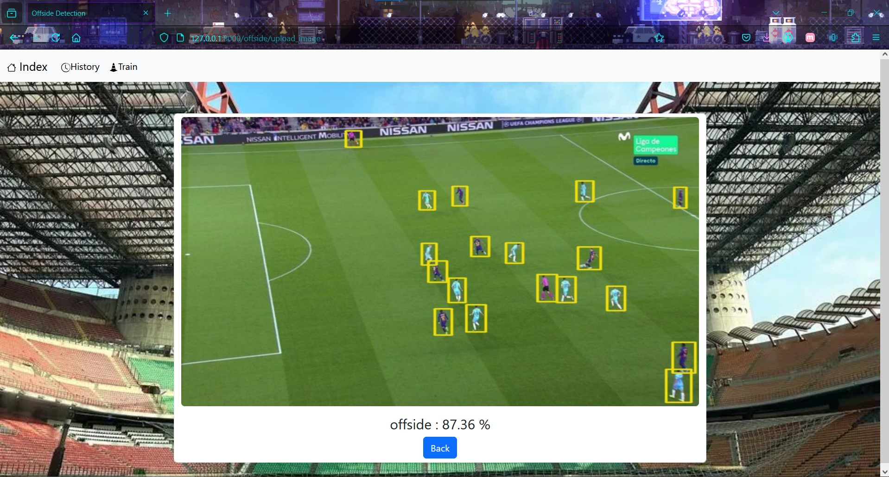
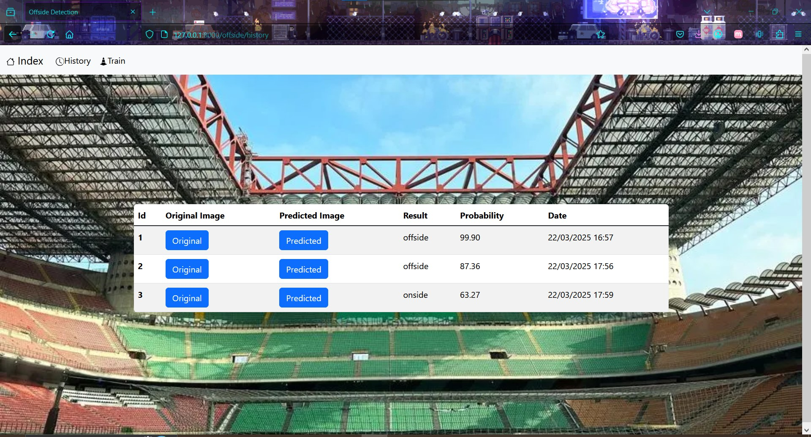
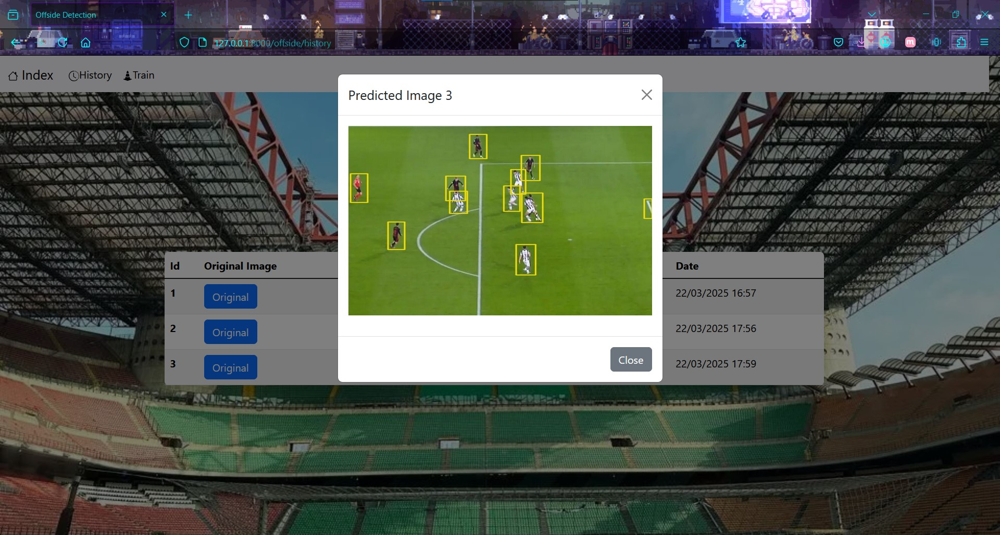

# OFFSIDE DETECTOR

(./LICENSE)

## What is this project?
 - The purpose of this project is to create an AI using PyTorch and YOLO to determine whether an image of a football match represents an offside or onside situation.

## What was the technologies used?
 -  This project was built using:
    - PyTorch 
    - YOLO
    - Roboflow (datasets management only)
    - Django (Web interface and Database)
    - Poetry (dependencies management)

## How does it work?
 - Every time an image is upload to the system, it is first processed YOLO model to identify the ball, players and referee. The resulting image is then analyzed by a PyTorch model to decide if it is offside or onside.
 - The project was trained with to datasets, one for YOLO and another for PyTorch, both datasets it's available on Roboflow, and if you click "Train" the system will download the datasets before start training (WARNING!: you will need a Roboflow account and a Roboflow account, see this [link](https://docs.roboflow.com/api-reference/authentication)):
    - You can find the dataset used for YOLO model [here](https://universe.roboflow.com/nikhil-chapre-xgndf/detect-players-dgxz0) (Note: this dataset was created for another user and maybe not be available forever).
    - You can find the dataset used  for PyTorch [here](https://universe.roboflow.com/football-sioqa/offside-dnedg).
    - The project already has a model trained inside the  app/ai/resources folder, if you want to train from scratch, delete all files inside this directory and click Train on web page. Note: if you don't delete these files, the system will load them and continue the train, which may lead to overfitting.

## How to run the system?
- Duplicate the .env.sample to a new file called only .env
    - Add on .env file your Roboflow API KEY.See this [link](https://docs.roboflow.com/api-reference/authentication) for instructions on how to obtain your API key.
- **Install dependencies:**
    - You can run like any other Django Application, but firstly install poetry, on your cli:
        ```bash
        pip instal poetry
        ```
    - Then, inside the folder where you downloaded this project, run:
        ```bash  
        poetry install
        ```
        This command will create a virtual environment and install all dependencies required to run.
- **Set up the database:**
    - To run, you will need first start the database as any Django project, so on your cli :
        ```bash
        poetry run python app/manage.py makemigrations offside
        poetry run python app/manage.py makemigrations 
        poetry run python app/manage.py migrate
        ```
- **Start the server:**
    - Now you only need to start the system and open [http://127.0.0.1:8000/offside/index](http://127.0.0.1:8000/offside/index) on your favorite browser:
        ```bash
        poetry run python app/manage.py runserver
        ```
- For more information on how to use Poetry please visit this [link](https://python-poetry.org/docs/basic-usage/).


## System in execution:
- You only have two pages and an additional option:
    - **Index**: where you upload image and send them to be predicted.
    - **History**: where you can see all images predicted.
    - **Train**: this will start training the model in a thread, please note that this may cause performance issues on your computer.
- Walktrough:
    - Uploading Image:
        
    - Checking the results:
     
    - Open History:
    
    - Looking history:
    

## Next steps:
- **Expand the [offside dataset](https://universe.roboflow.com/football-sioqa/offside-dnedg)**:
    - As any AI model, the dataset need to be big as possible for the AI understand exactly what you want, the current dataset for Offside detection for PyTorch has only 30 images, and with augmentation steps, this is turned into 101 images divided in three parts: valid, test and train, but it's still not big enough, the next step would be getting more images for this dataset.
- **Enable video upload**: 
    - Add functionality to upload videos and identify the frames where an offside occurs. 
    - This may require developing another PyTorch model to analyze frames and determine which ones need verification.